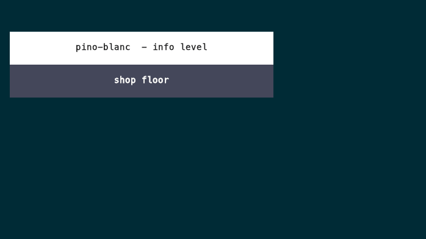

# pino-blanc

A themed logger to bring order and beauty to your logging experience. Built around Pino for low overhead compatibility with top frameworks and toolkits (Express, Hapi, Koa, VueJS, React, Svelte, Node). Works the same way in the browser, too.

### Features


| 🎨 Pre-built color schemes | 📐 Custom spacing and padding     |
| -------------------------- | --------------------------------- |
| ▦ Templates and columns    | ⚡ Progress bars and live-printing |
| 😎 Inline Emojis           | 🪧 Banner layouts                 |


## Preview



## Install

```bash
yarn add @westlane/pino-blanc
```

 

## Usage


### Browser

```ts
import { createLogger } from "@westlane/pino-blanc/browser";

const log = createLogger("app", { theme: "solarized-dark" });
log.verbose("ready", { hello: "world" });
```


### Node

```ts
import { createLogger } from "@westlane/pino-blanc";

const log = createLogger("server", { theme: "solarized-dark" });
log.info("ready", { port: 3030 });
```


### Multi-Transport

```ts
import pino from "pino";

const transport = pino.transport({
  targets: [
    {
      target: "@westlane/pino-blanc/pretty",
      level: "debug",
      options: { options: { theme: "solarized-dark" } },
    },
    {
      target: "pino/file",
      level: "info",
      options: { destination: "./logs/server.ndjson", mkdir: true },
    },
  ],
});

const log = pino(
  { level: "debug", base: { module: "server" }, timestamp: pino.stdTimeFunctions.isoTime },
  transport,
);

log.info({ port: 3030 }, "ready");
```


### React

```tsx
import { PBProvider, useLogger, createLogger } from "@westlane/pino-blanc/react";

const log = createLogger("app", { theme: "solarized-dark" });

<PBProvider logger={log}>
  <App />
</PBProvider>

// in a component
const log = useLogger("Checkout");
log.info("mounted");
```


### Vue

```ts
import { createApp } from "vue";
import { createLogger, pbPlugin, useLogger } from "@westlane/pino-blanc/vue";

const log = createLogger("app", { theme: "nord" });
createApp(App).use(pbPlugin, { logger: log }).mount("#app");

// in setup()
const log = useLogger("Checkout");
```


### Svelte

```ts
import { createLogger, setPB, getLogger } from "@westlane/pino-blanc/svelte";

const log = createLogger("app", { theme: "dracula" });
// root layout / App.svelte
setPB(log);

// in a child component
const log = getLogger("Checkout");
```


## License

MIT